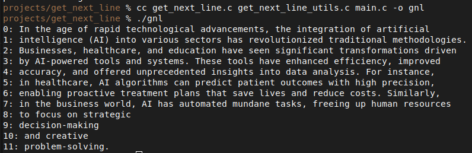

# Get_Next_Line

## Overview
||
|:--:|

The `get_next_line` project involves creating a function that reads and returns a line from a given file descriptor. This function can be repeatedly called to read a file one line at a time.

The main.c file can be used for testing the project localy.

## Function Prototype
```c
char *get_next_line(int fd);
```
## Compilation
Compile your project using the following command:
```
cc -Wall -Wextra -Werror -D BUFFER_SIZE=<size> get_next_line.c get_next_line_utils.c -o get_next_line

```
Replace <size> with the desired buffer size.


## Function Behavior
- The function reads a line from the specified file descriptor.
- It returns the line read, including the newline character.
- If there is nothing left to read or an error occurs, it returns NULL.
- Ensure it handles both file and standard input.

## Bonus Behavior
- Manage multiple file descriptors simultaneously.
- Use only one static variable. (This also implimented in the regular part)

## Additional Tests
A special thanks to [xicodomingues' francinette](https://github.com/xicodomingues/francinette) testing suite.

## Example Output

